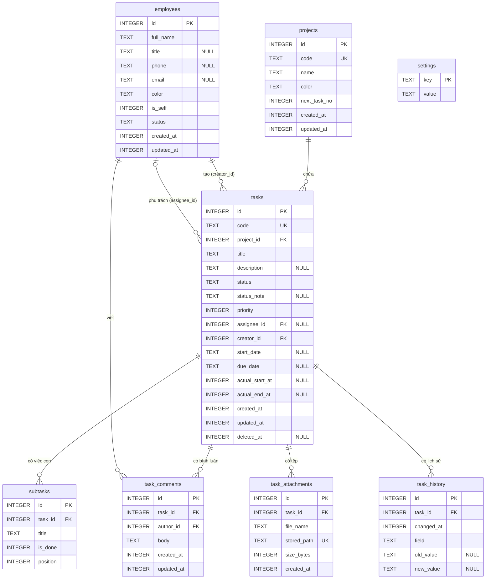

# 03 — Cơ sở dữ liệu (v0.3, bản gọn)

> 12/09/2026 · Nguồn sự thật: đặc tả bản gọn v3 (§3 Dữ liệu, §6 Trạng thái, §7 Quy tắc). Thay toàn bộ bản v0.2 (đã bỏ phòng ban, cột Kanban, tag, nhắc nhở, FTS5…).
> Sơ đồ xem trực quan (offline): [`design/erd.html`](../design/erd.html).

## 1. Tóm tắt

- SQLite một file, WAL, bật khoá ngoại, bảng `STRICT`. **8 bảng**, không bảng nào khác (ngoài `_sqlx_migrations` do sqlx tự tạo).
- Thời điểm = `INTEGER` epoch **ms UTC**; ngày lịch = `TEXT 'YYYY-MM-DD'`; ID = `INTEGER PRIMARY KEY`; enum = `TEXT` + `CHECK`.
- Không có cột kỹ thuật ngoài đặc tả. Tìm kiếm không dấu (quy tắc 11) làm trong Rust bằng `fold_vi` ([05 §5](05-kien-truc.md#5-ghi-việc-và-lịch-sử)), không lưu cột chuẩn hoá.
- Seed nằm ngay trong migration: dự án `id = 1` "Việc chung" (`VC`) và nhân viên `id = 1` "Tôi" (`is_self = 1`).

| Bảng | Vai trò |
|---|---|
| `employees` | Danh mục nhân viên: người phụ trách, người tạo, tác giả bình luận. Đúng 1 bản ghi "Tôi" |
| `projects` | Dự án, cấp tiền tố và bộ đếm cho mã việc |
| `tasks` | Công việc (thực thể trung tâm), có xoá mềm (Thùng rác) |
| `subtasks` | Việc con (checklist) |
| `task_comments` | Bình luận |
| `task_attachments` | Siêu dữ liệu tệp đã chép vào thư mục dữ liệu |
| `task_history` | Lịch sử thay đổi, lưu sẵn chữ để hiển thị |
| `settings` | Cặp key/value (giao diện) |

## 2. Quyết định nền tảng

- **File DB:** `%APPDATA%\vn.personal.quanlytask\quanlytask.db` (= `app_data_dir()`). Mỗi connection đặt `journal_mode = WAL`, `foreign_keys = ON` (SQLite mặc định tắt; mọi `ON DELETE` bên dưới cần PRAGMA này), `synchronous = NORMAL`, `busy_timeout = 5000`. Pool `SqlitePool`, `max_connections = 4`; transaction ghi dùng `BEGIN IMMEDIATE`.
- **`STRICT`** (SQLite ≥ 3.37): chèn sai kiểu bị từ chối. Chỉ dùng `INTEGER` và `TEXT`. Boolean = `INTEGER` 0/1.
- **Thời gian:** `created_at`, `updated_at`, `deleted_at`, `actual_*_at`, `changed_at` là ms UTC, khớp `Date.now()` và `i64`. `start_date`, `due_date` là ngày lịch (hạn chót không có giờ). Rust tính sẵn các tham số `:now`, `:today` (`'YYYY-MM-DD'` theo giờ máy), `:week_start` (Thứ Hai 00:00 giờ máy, ms), `:next_week_start` (Thứ Hai tuần sau 00:00, ms).
- **ID:** `INTEGER PRIMARY KEY` (alias `rowid`), lấy ID mới bằng `RETURNING id`, không dùng `AUTOINCREMENT`. Mã việc không tái dùng nhờ `projects.next_task_no` chỉ tăng, không dựa vào `id`.
- **Màu** (`employees.color`, `projects.color`): lưu **mã hex** `#RRGGBB` lấy từ bảng màu ở [04 §3.3](04-thiet-ke-ui.md#33-màu-dự-án-và-avatar). Service kiểm tra đúng dạng hex.
- **Đang mở** = `status IN ('new', 'in_progress', 'waiting')`. **Quá hạn** = đang mở ∧ `deleted_at IS NULL` ∧ `due_date < :today`.
- **Quy tắc trạng thái ở service** (đặc tả §6): vào `in_progress` mà `actual_start_at` trống thì điền `:now`; vào `done` thì `actual_end_at = :now` (luôn lấy thời điểm chuyển, sửa lại được sau); rời `done` thì `actual_end_at = NULL`. Mọi thay đổi của việc (kể cả việc con, bình luận, tệp) đặt `tasks.updated_at = :now`.

## 3. ERD

Ký hiệu: `||` đúng 1 · `|o` 0 hoặc 1 · `o{` 0..n. `"NULL"` = cột cho phép NULL.



## 4. Từ điển dữ liệu

Cột chung, không nhắc lại: `id` INTEGER PK (tự cấp); `created_at` / `updated_at` INTEGER ms, bắt buộc, do service ghi. "Bắt buộc" = `NOT NULL`.

| Bảng.cột | Kiểu | Bắt buộc | Ý nghĩa |
|---|---|---|---|
| `employees.full_name` | TEXT | Có | Họ tên, 1–100 ký tự |
| `employees.title` / `phone` / `email` | TEXT | — | Chức danh (≤ 100) / điện thoại (≤ 20) / email (≤ 254, kiểm ở service) |
| `employees.color` | TEXT | Có | Màu đại diện, mã hex `#RRGGBB`, mặc định `#6E56CF` |
| `employees.is_self` | INTEGER | Có | 1 = hồ sơ "Tôi" (manager). Đúng 1 dòng, không đổi, không xoá |
| `employees.status` | TEXT | Có | `active` (Đang làm việc) \| `inactive` (Đã nghỉ). "Tôi" luôn `active` |
| `projects.code` | TEXT | Có | Mã dự án, UNIQUE, 2–6 chữ in hoa/số, bắt đầu bằng chữ. Ví dụ `WEB` |
| `projects.name` | TEXT | Có | Tên dự án, 1–100 ký tự |
| `projects.color` | TEXT | Có | Màu dự án, mã hex `#RRGGBB`, mặc định `#5B8DEF` |
| `projects.next_task_no` | INTEGER | Có | Số của mã việc kế tiếp, ≥ 1, chỉ tăng |
| `tasks.code` | TEXT | Có | Mã việc `<mã dự án>-<số>`, UNIQUE, không đổi kể cả khi chuyển dự án |
| `tasks.project_id` | INTEGER | Có | → `projects.id` (RESTRICT) |
| `tasks.title` | TEXT | Có | Tiêu đề, 1–500 ký tự |
| `tasks.description` | TEXT | — | Mô tả |
| `tasks.status` | TEXT | Có | `new` \| `in_progress` \| `waiting` \| `done` \| `cancelled`, mặc định `new` |
| `tasks.status_note` | TEXT | — | Lý do chờ/huỷ (tuỳ chọn). Service xoá khi chuyển sang trạng thái khác `waiting`/`cancelled`. Lý do được ghi kèm trong dòng lịch sử đổi trạng thái (`new_value`, ví dụ "Đang chờ (lý do: …)") |
| `tasks.priority` | INTEGER | Có | 1 Thấp · 2 Trung bình (mặc định) · 3 Cao · 4 Khẩn cấp |
| `tasks.assignee_id` | INTEGER | — | → `employees.id` (RESTRICT). NULL = "Chưa giao" |
| `tasks.creator_id` | INTEGER | Có | → `employees.id` (RESTRICT), mặc định "Tôi" |
| `tasks.start_date` / `due_date` | TEXT | — | Ngày bắt đầu / hạn chót `YYYY-MM-DD`, `start_date ≤ due_date` |
| `tasks.actual_start_at` / `actual_end_at` | INTEGER | — | Bắt đầu / kết thúc thực tế (ms), `end ≥ start` |
| `tasks.deleted_at` | INTEGER | — | Có giá trị = đang ở Thùng rác (xoá vĩnh viễn sau 30 ngày) |
| `subtasks.task_id` | INTEGER | Có | → `tasks.id` (CASCADE) |
| `subtasks.title` / `is_done` / `position` | TEXT / INTEGER / INTEGER | Có | Nội dung 1–500 ký tự / đã xong 0-1 / thứ tự (thêm mới = max + 1) |
| `task_comments.task_id` | INTEGER | Có | → `tasks.id` (CASCADE) |
| `task_comments.author_id` | INTEGER | Có | → `employees.id` (RESTRICT), mặc định "Tôi" |
| `task_comments.body` | TEXT | Có | Nội dung, 1–5000 ký tự |
| `task_attachments.task_id` | INTEGER | Có | → `tasks.id` (CASCADE) |
| `task_attachments.file_name` | TEXT | Có | Tên gốc để hiển thị, 1–255 ký tự |
| `task_attachments.stored_path` | TEXT | Có | Đường dẫn tương đối, UNIQUE, dạng `attachments/<uuid>.<ext>` |
| `task_attachments.size_bytes` | INTEGER | Có | 0 – 52.428.800 (50 MB) |
| `task_history.task_id` | INTEGER | Có | → `tasks.id` (CASCADE) |
| `task_history.changed_at` | INTEGER | Có | Thời điểm thay đổi (ms) |
| `task_history.field` | TEXT | Có | Loại thay đổi (16 giá trị, xem DDL). UI dịch sang nhãn: `priority` → "Ưu tiên" |
| `task_history.old_value` / `new_value` | TEXT | — | Chữ hiển thị sẵn: `"Trung bình"` → `"Cao"`; tệp: tên file; `created`: mã việc; `description`: để NULL (UI hiện "Mô tả: đã sửa") |
| `settings.key` / `value` | TEXT | Có | PK / giá trị chữ. Hiện chỉ có `ui.theme` = `light` \| `dark` \| `system` (thiếu dòng = `system`) |

## 5. DDL — migration `0001_init.sql`

```sql
-- 0001_init.sql — Quản lý Task, schema v0.3 (bản gọn)
-- sqlx chạy file trong 1 transaction. PRAGMA đặt ở connection (§2), không đặt ở đây.

CREATE TABLE employees (
  id             INTEGER PRIMARY KEY,
  full_name      TEXT    NOT NULL CHECK (length(trim(full_name)) BETWEEN 1 AND 100),
  title          TEXT,
  phone          TEXT,
  email          TEXT,
  color          TEXT    NOT NULL DEFAULT '#6E56CF',
  is_self        INTEGER NOT NULL DEFAULT 0 CHECK (is_self IN (0, 1)),
  status         TEXT    NOT NULL DEFAULT 'active' CHECK (status IN ('active', 'inactive')),
  created_at     INTEGER NOT NULL,
  updated_at     INTEGER NOT NULL,
  CHECK (is_self = 0 OR status = 'active')                           -- "Tôi" không chuyển Đã nghỉ
) STRICT;

CREATE TABLE projects (
  id           INTEGER PRIMARY KEY,
  code         TEXT    NOT NULL UNIQUE CHECK (length(code) BETWEEN 2 AND 6
                 AND code GLOB '[A-Z]*' AND code NOT GLOB '*[^A-Z0-9]*'),
  name         TEXT    NOT NULL CHECK (length(trim(name)) BETWEEN 1 AND 100),
  color        TEXT    NOT NULL DEFAULT '#5B8DEF',
  next_task_no INTEGER NOT NULL DEFAULT 1 CHECK (next_task_no >= 1),
  created_at   INTEGER NOT NULL,
  updated_at   INTEGER NOT NULL
) STRICT;

CREATE TABLE tasks (
  id              INTEGER PRIMARY KEY,
  code            TEXT    NOT NULL UNIQUE CHECK (code GLOB '[A-Z]*-[1-9]*'),
  project_id      INTEGER NOT NULL REFERENCES projects (id) ON DELETE RESTRICT,
  title           TEXT    NOT NULL CHECK (length(trim(title)) BETWEEN 1 AND 500),
  description     TEXT,
  status          TEXT    NOT NULL DEFAULT 'new'
                    CHECK (status IN ('new', 'in_progress', 'waiting', 'done', 'cancelled')),
  status_note     TEXT,
  priority        INTEGER NOT NULL DEFAULT 2 CHECK (priority BETWEEN 1 AND 4),
  assignee_id     INTEGER REFERENCES employees (id) ON DELETE RESTRICT,
  creator_id      INTEGER NOT NULL REFERENCES employees (id) ON DELETE RESTRICT,
  start_date      TEXT    CHECK (start_date IS NULL OR date(start_date) IS start_date),
  due_date        TEXT    CHECK (due_date IS NULL OR date(due_date) IS due_date),
  actual_start_at INTEGER,
  actual_end_at   INTEGER,
  created_at      INTEGER NOT NULL,
  updated_at      INTEGER NOT NULL,
  deleted_at      INTEGER,
  CHECK (start_date IS NULL OR due_date IS NULL OR start_date <= due_date),
  CHECK (actual_start_at IS NULL OR actual_end_at IS NULL OR actual_end_at >= actual_start_at)
) STRICT;

CREATE TABLE subtasks (
  id       INTEGER PRIMARY KEY,
  task_id  INTEGER NOT NULL REFERENCES tasks (id) ON DELETE CASCADE,
  title    TEXT    NOT NULL CHECK (length(trim(title)) BETWEEN 1 AND 500),
  is_done  INTEGER NOT NULL DEFAULT 0 CHECK (is_done IN (0, 1)),
  position INTEGER NOT NULL
) STRICT;

CREATE TABLE task_comments (
  id         INTEGER PRIMARY KEY,
  task_id    INTEGER NOT NULL REFERENCES tasks (id) ON DELETE CASCADE,
  author_id  INTEGER NOT NULL REFERENCES employees (id) ON DELETE RESTRICT,
  body       TEXT    NOT NULL CHECK (length(trim(body)) BETWEEN 1 AND 5000),
  created_at INTEGER NOT NULL,
  updated_at INTEGER NOT NULL
) STRICT;

CREATE TABLE task_attachments (
  id          INTEGER PRIMARY KEY,
  task_id     INTEGER NOT NULL REFERENCES tasks (id) ON DELETE CASCADE,
  file_name   TEXT    NOT NULL CHECK (length(file_name) BETWEEN 1 AND 255),
  stored_path TEXT    NOT NULL UNIQUE,                               -- 'attachments/<uuid>.<ext>'
  size_bytes  INTEGER NOT NULL CHECK (size_bytes BETWEEN 0 AND 52428800),
  created_at  INTEGER NOT NULL
) STRICT;

CREATE TABLE task_history (
  id         INTEGER PRIMARY KEY,
  task_id    INTEGER NOT NULL REFERENCES tasks (id) ON DELETE CASCADE,
  changed_at INTEGER NOT NULL,
  field      TEXT    NOT NULL CHECK (field IN ('created', 'title', 'description', 'project', 'status',
               'priority', 'assignee', 'creator', 'start_date', 'due_date', 'actual_start', 'actual_end',
               'attachment_added', 'attachment_removed', 'deleted', 'restored')),
  old_value  TEXT,
  new_value  TEXT
) STRICT;

CREATE TABLE settings (
  key   TEXT NOT NULL PRIMARY KEY,
  value TEXT NOT NULL
) STRICT, WITHOUT ROWID;

-- Index
CREATE UNIQUE INDEX ux_employees_self   ON employees (is_self) WHERE is_self = 1;   -- tối đa 1 "Tôi"
CREATE INDEX ix_tasks_project           ON tasks (project_id, status);
CREATE INDEX ix_tasks_assignee          ON tasks (assignee_id, status);
CREATE INDEX ix_tasks_creator           ON tasks (creator_id);                       -- kiểm FK khi xoá nhân viên
CREATE INDEX ix_tasks_due               ON tasks (due_date) WHERE deleted_at IS NULL;
CREATE INDEX ix_tasks_deleted           ON tasks (deleted_at) WHERE deleted_at IS NOT NULL;
CREATE INDEX ix_subtasks_task           ON subtasks (task_id, position);
CREATE INDEX ix_comments_task           ON task_comments (task_id, created_at);
CREATE INDEX ix_comments_author         ON task_comments (author_id);
CREATE INDEX ix_attachments_task        ON task_attachments (task_id);
CREATE INDEX ix_history_task            ON task_history (task_id, changed_at);

-- Bảo vệ dữ liệu hệ thống (mã lỗi được Rust ánh xạ sang thông báo)
CREATE TRIGGER trg_projects_keep_default BEFORE DELETE ON projects WHEN OLD.id = 1
BEGIN SELECT RAISE(ABORT, 'PROJECT_DEFAULT_LOCKED'); END;
CREATE TRIGGER trg_employees_keep_self BEFORE DELETE ON employees WHEN OLD.is_self = 1
BEGIN SELECT RAISE(ABORT, 'SELF_LOCKED'); END;
CREATE TRIGGER trg_employees_self_fixed BEFORE UPDATE OF is_self ON employees
WHEN NEW.is_self IS NOT OLD.is_self BEGIN SELECT RAISE(ABORT, 'SELF_LOCKED'); END;
CREATE TRIGGER trg_tasks_code_fixed BEFORE UPDATE OF code ON tasks
WHEN NEW.code IS NOT OLD.code BEGIN SELECT RAISE(ABORT, 'TASK_CODE_LOCKED'); END;

-- Seed
INSERT INTO projects (id, code, name, color, next_task_no, created_at, updated_at)
VALUES (1, 'VC', 'Việc chung', '#5B8DEF', 1,
        CAST(strftime('%s', 'now') AS INTEGER) * 1000, CAST(strftime('%s', 'now') AS INTEGER) * 1000);
INSERT INTO employees (id, full_name, color, is_self, status, created_at, updated_at)
VALUES (1, 'Tôi', '#6E56CF', 1, 'active',
        CAST(strftime('%s', 'now') AS INTEGER) * 1000, CAST(strftime('%s', 'now') AS INTEGER) * 1000);
```

Ràng buộc do FK lo, service chỉ cần bắt lỗi và báo:
- Xoá dự án còn việc (kể cả trong Thùng rác) → lỗi FK (RESTRICT). "Việc chung" (`id = 1`) → `PROJECT_DEFAULT_LOCKED`.
- Xoá nhân viên đã có việc (phụ trách/tạo) hoặc bình luận → lỗi FK. UI đề nghị "Chuyển sang Đã nghỉ".
- Xoá vĩnh viễn việc → `CASCADE` xoá việc con, bình luận, dòng tệp, lịch sử. File vật lý xoá sau khi commit (§6).

**Seed đặt trong migration, không để code "lần đầu chạy" tạo:** migration `0001` chạy đúng một lần, cùng transaction với schema, ngay lần đầu app mở, nên đúng yêu cầu "app tự tạo lần đầu chạy". Nhờ vậy mọi DB (mới tạo hay khôi phục từ `.zip`) luôn có `projects.id = 1` và `employees.id = 1`; code không cần nhánh kiểm tra "đã có chưa". Thời gian seed dùng `strftime('%s')` (chạy được trên mọi phiên bản SQLite, độ chính xác giây là đủ).

## 6. Tệp đính kèm và sao lưu

```
%APPDATA%\vn.personal.quanlytask\
├─ quanlytask.db   (+ -wal, -shm khi chạy)
├─ attachments\    <uuid>.<ext>   (một thư mục phẳng; tên gốc chỉ nằm trong file_name)
├─ backups\        auto-before-restore-*.zip, pre-migrate-*.db (giữ 5 bản gần nhất mỗi loại)
├─ logs\           app.log
└─ restore-pending\  (chỉ có tạm thời: dữ liệu giải nén chờ thay khi khởi động lại)
```

- **Thêm tệp:** kiểm tra ≤ 50 MB → chép sang `attachments\<uuid>.<ext>` → transaction: `INSERT task_attachments` + lịch sử `attachment_added`. Lỗi ở DB thì xoá file vừa chép. Mở tệp bằng ứng dụng mặc định của Windows.
- **Gỡ tệp / xoá vĩnh viễn việc:** lấy `stored_path` trước, `DELETE` và commit, rồi mới xoá file (xoá file lỗi thì ghi log, bỏ qua).
- **Sao lưu** ra file `QuanLyTask-2026-09-12_1630.zip`:

```
├─ manifest.json    {"appVersion":"1.0.0","schemaVersion":1,"createdAt":1789206600000,"dbSha256":"…"}
├─ quanlytask.db    bản chụp bằng VACUUM INTO (nhất quán dù đang WAL)
└─ attachments/     mọi file có dòng trong task_attachments
```

- **Khôi phục** (theo [05 §6](05-kien-truc.md#6-tệp-đính-kèm-sao-lưu-và-khôi-phục)): đọc `manifest.json` (`schemaVersion` ≤ bản app, `dbSha256` khớp) → chỉ nhận `manifest.json`, `quanlytask.db` ở gốc zip và các mục dưới `attachments/`, từ chối mục có `..` hoặc đường dẫn tuyệt đối → giải nén vào `restore-pending\` → `PRAGMA integrity_check` = `ok` → tự sao lưu dữ liệu hiện tại thành `backups\auto-before-restore-<ts>.zip` → app khởi động lại. Lúc khởi động, nếu có `restore-pending\` thì thay DB + `attachments\` **trước khi mở pool**, rồi chạy migration nếu bản sao lưu cũ hơn.

## 7. Truy vấn chính

Tham số viết `:ten` cho dễ đọc; trong sqlx dùng `?`.

**Q1. Tổng quan: 4 số và "Cần chú ý"**
```sql
SELECT SUM(status IN ('new', 'in_progress', 'waiting'))                      AS dang_mo,
       SUM(status IN ('new', 'in_progress', 'waiting') AND due_date < :today) AS qua_han,
       SUM(status = 'waiting')                                               AS dang_cho,
       SUM(status = 'done' AND actual_end_at >= :week_start
                          AND actual_end_at < :next_week_start)             AS xong_tuan_nay
FROM tasks WHERE deleted_at IS NULL;

SELECT id, code, title, due_date, assignee_id FROM tasks            -- quá hạn + đến hạn hôm nay/mai
WHERE deleted_at IS NULL AND status IN ('new', 'in_progress', 'waiting') AND due_date <= :tomorrow
ORDER BY due_date, priority DESC;
```

**Q2. Bảng Công việc có lọc** (giá trị bộ lọc theo `TaskFilter` ở [05 §4](05-kien-truc.md#4-command-ipc); tham số NULL = bỏ lọc; `:assignee` = id hoặc `'unassigned'` ("Chưa giao"); `:due` = `overdue` \| `thisWeek` \| `noDue`; `:statuses` là mảng JSON, mặc định `["new","in_progress","waiting"]`)
```sql
SELECT t.id, t.code, t.title, p.name AS project, p.color, a.full_name AS assignee, t.status, t.priority,
       t.start_date, t.due_date, c.full_name AS creator, t.created_at
FROM tasks t
JOIN projects p       ON p.id = t.project_id
LEFT JOIN employees a ON a.id = t.assignee_id
JOIN employees c      ON c.id = t.creator_id
WHERE t.deleted_at IS NULL
  AND (:project_id IS NULL OR t.project_id = :project_id)
  AND (:assignee IS NULL OR (:assignee = 'unassigned' AND t.assignee_id IS NULL) OR t.assignee_id = :assignee)
  AND t.status IN (SELECT value FROM json_each(:statuses))
  AND (:due IS NULL
       OR (:due = 'overdue'  AND t.status IN ('new', 'in_progress', 'waiting') AND t.due_date < :today)
       OR (:due = 'thisWeek' AND t.due_date BETWEEN :monday AND :sunday)
       OR (:due = 'noDue'    AND t.due_date IS NULL))
ORDER BY t.created_at DESC;
```
Từ khoá `q` (R-11) không lọc bằng SQL: Rust lọc kết quả của Q2 bằng `fold_vi(code + title)` (Q2 luôn trả theo `created_at DESC` (mặc định của bảng Công việc). Sắp xếp khi bấm tiêu đề cột làm ở giao diện ([05](05-kien-truc.md)), không ghép chuỗi SQL. Sắp theo Mã: theo mã dự án rồi số thứ tự sau dấu `-`; theo Hạn: việc không có hạn nằm cuối.(substr(t.code, instr(t.code, '-') + 1) AS INTEGER)`; theo Hạn: `t.due_date IS NULL, t.due_date`.

**Q3. Tạo việc, sinh mã trong cùng transaction**
```sql
BEGIN IMMEDIATE;
UPDATE projects SET next_task_no = next_task_no + 1 WHERE id = :project_id
RETURNING code || '-' || (next_task_no - 1) AS task_code;              -- ví dụ 'WEB-12'
INSERT INTO tasks (code, project_id, title, description, status, status_note, priority,
                   assignee_id, creator_id, start_date, due_date, actual_start_at, actual_end_at,
                   created_at, updated_at)
VALUES (:task_code, :project_id, :title, :description, :status, :status_note, :priority,
        :assignee_id, :creator_id, :start_date, :due_date,
        :actual_start_at, :actual_end_at,                              -- tạo ở Đang làm/Hoàn thành → :now
        :now, :now)
RETURNING id;
INSERT INTO subtasks (task_id, title, is_done, position) VALUES (:task_id, :sub_title, 0, :i);  -- mỗi dòng
INSERT INTO task_attachments (task_id, file_name, stored_path, size_bytes, created_at)
VALUES (:task_id, :file_name, :stored_path, :size, :now);                                     -- tệp đã chép sẵn
INSERT INTO task_history (task_id, changed_at, field, old_value, new_value)
VALUES (:task_id, :now, 'created', NULL, :task_code);
COMMIT;
```
Mã dự án chỉ đổi được khi dự án chưa có việc nào, kể cả trong Thùng rác (service kiểm tra; đã có việc thì UI khoá ô Mã). Để dự án mới lấy lại mã cũ không sinh trùng `tasks.code`, khi tạo dự án với mã `:code`, đặt `next_task_no` bằng
`SELECT COALESCE(MAX(CAST(substr(code, length(:code) + 2) AS INTEGER)), 0) + 1 FROM tasks WHERE code GLOB :code || '-[0-9]*'`.

**Q4. Sửa việc và ghi lịch sử** (service so giá trị cũ/mới, mỗi trường đổi ghi 1 dòng, cùng transaction)
```sql
BEGIN IMMEDIATE;
UPDATE tasks SET status = 'done', status_note = NULL, actual_end_at = :now,
                 updated_at = :now
WHERE id = :id;
INSERT INTO task_history (task_id, changed_at, field, old_value, new_value)
VALUES (:id, :now, 'status', 'Đang làm', 'Hoàn thành');
-- actual_end_at = :now → thêm dòng 'actual_end' ((trống) → '12/09/2026 16:30')
COMMIT;

SELECT changed_at, field, old_value, new_value FROM task_history    -- tab Lịch sử
WHERE task_id = :id ORDER BY changed_at DESC, id DESC;
```

**Q5. Thùng rác và dọn 30 ngày** (chạy khi khởi động app và khi mở màn Thùng rác; "Dọn sạch" = bỏ điều kiện thời gian)
```sql
SELECT t.id, t.code, t.title, p.name AS project, t.deleted_at,
       30 - (:now - t.deleted_at) / 86400000 AS con_ngay
FROM tasks t JOIN projects p ON p.id = t.project_id
WHERE t.deleted_at IS NOT NULL ORDER BY t.deleted_at DESC;

BEGIN IMMEDIATE;
SELECT a.stored_path FROM task_attachments a JOIN tasks t ON t.id = a.task_id   -- file cần xoá sau commit
WHERE t.deleted_at IS NOT NULL AND t.deleted_at < :now - 2592000000;
DELETE FROM tasks WHERE deleted_at IS NOT NULL AND deleted_at < :now - 2592000000;  -- CASCADE phần còn lại
COMMIT;
```

## 8. Chính sách migration

1. File `src-tauri/migrations/NNNN_mo_ta.sql`, nhúng bằng `sqlx::migrate!("./migrations")`, chạy lúc khởi động trước khi mở cửa sổ. Mỗi migration chạy trong 1 transaction; lỗi → rollback, app báo lỗi, không chạy tiếp.
2. Chỉ thêm, không sửa: migration đã phát hành là bất biến (sqlx kiểm checksum). Schema v0.1/v0.2 chưa từng phát hành nên `0001_init.sql` được viết lại theo tài liệu này.
3. Trước khi chạy migration mới trên DB đã có dữ liệu: `VACUUM INTO 'backups\pre-migrate-v<cũ>-to-v<mới>-<ts>.db'`.
4. DB có version lớn hơn bản app (cài bản cũ đè bản mới) → không mở DB, báo cài bản mới hơn.
5. Đổi `CHECK`/FK phải dựng lại bảng theo quy trình 12 bước của SQLite (migration riêng, tắt `foreign_keys` tạm thời, nhớ tạo lại index/trigger), kết thúc bằng `PRAGMA foreign_key_check`.
6. Truy vấn sqlx dạng runtime (`sqlx::query`, `query_as`), không dùng macro `query!` nên không cần `.sqlx/` hay `SQLX_OFFLINE`.
