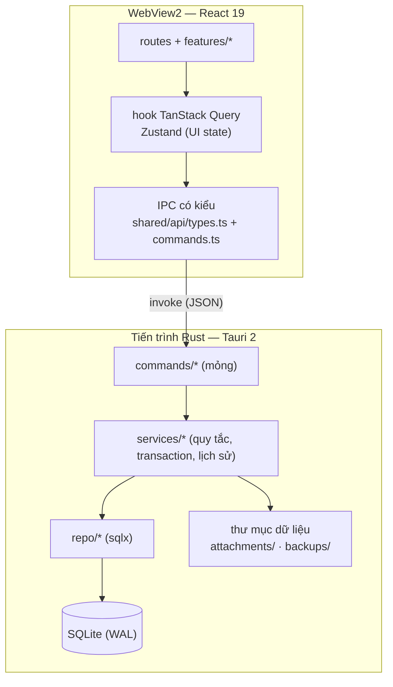

# 05 — Kiến trúc

> **Tóm tắt**
> - Tầng: React UI → IPC có kiểu viết tay (`dto.rs` ⇄ `types.ts`) → commands (mỏng) → services (quy tắc R-01…R-11, transaction, ghi lịch sử) → repo (sqlx) → SQLite. Logic nghiệp vụ **chỉ nằm ở services Rust**.
> - Một cửa sổ, không tiến trình nền, không event từ Rust sang UI. Sau mỗi thao tác ghi, UI làm mới dữ liệu bằng TanStack Query.
> - Quy tắc nghiệp vụ ở [02 — Nghiệp vụ](02-nghiep-vu.md), 8 bảng dữ liệu ở [03 — Cơ sở dữ liệu](03-co-so-du-lieu.md), công nghệ ở [01](01-cong-nghe.md).

---

## 1. Sơ đồ tầng



**Quy tắc phụ thuộc:** mỗi tầng chỉ gọi tầng ngay dưới. `commands` không chạm `repo`. `repo` không biết quy tắc nghiệp vụ. `domain/` là Rust thuần (không IO), tầng nào cũng dùng được. Frontend: `app → features → shared` (một chiều), feature không import feature khác (trừ `task-form` và `task-detail` được mở từ nhiều nơi, xem §2).

## 2. Cây thư mục frontend

```
src/
├─ main.tsx                         # entry
├─ app/
│  ├─ providers.tsx                  # QueryClient, ThemeProvider, Toaster
│  ├─ router.tsx                     # TanStack Router code-based: / (SC-1) · /tasks (SC-2, ?q=) ·
│  │                                 #   /projects/$projectId (SC-3, ?view=list) · /employees (SC-6) ·
│  │                                 #   /employees/$employeeId (SC-7) · /trash (SC-8) · /settings (SC-9);
│  │                                 #   ?task=id ở mọi route mở SC-5
│  └─ layout/                        # thanh tiêu đề tự vẽ, Sidebar, TopBar (tìm kiếm, Sáng/Tối, "Thêm việc");
│                                    #   render TaskDetailPanel, TaskFormDialog, ProjectDialog
├─ features/
│  ├─ dashboard/      # StatCards (4 số), AttentionList, ByEmployeeTable
│  ├─ tasks/          # TaskTable (cột, sắp xếp), TaskFilters, useTasks
│  ├─ projects/       # SidebarProjects, ProjectHeader (tiến độ), ProjectDialog, DeleteProjectDialog
│  │  └─ kanban/      # Board, Column, Card — bọc @dnd-kit/core ở đây
│  ├─ task-form/      # SC-4: TaskFormDialog, SubtaskRows, AttachmentPicker, validate.ts
│  ├─ task-detail/    # SC-5: TaskDetailPanel, StatusSelect, StatusNoteDialog,
│  │                  #   tabs: SubtasksTab, CommentsTab, FilesTab, HistoryTab
│  ├─ employees/      # EmployeeTable, EmployeeDialog, EmployeeDetail, DeactivateDialog (R-04)
│  ├─ trash/          # TrashTable
│  └─ settings/       # ProfileSection, ThemeSection, DataSection (sao lưu/khôi phục)
├─ shared/
│  ├─ ui/             # component shadcn (Radix), không chứa nghiệp vụ
│  ├─ api/            # types.ts (DTO viết tay, khớp dto.rs), commands.ts (hàm gọi có kiểu, ném AppError),
│  │                  #   queries.ts, query-keys.ts, errors.ts
│  └─ lib/            # date.ts (date-fns, locale vi), status.ts (nhãn + màu 5 trạng thái), priority.ts
└─ styles/globals.css # Tailwind v4, token màu sáng/tối
index.html · vite.config.ts · biome.json · tsconfig.json
```

Toàn bộ chuỗi hiển thị viết thẳng tiếng Việt, không có tầng i18n.

## 3. Cây thư mục `src-tauri`

```
src-tauri/
├─ Cargo.toml · build.rs · tauri.conf.json
├─ capabilities/main.json          # quyền của cửa sổ duy nhất (§9)
├─ migrations/0001_init.sql        # 8 bảng, xem 03
├─ tests/                          # test tích hợp services trên SQLite in-memory
└─ src/
   ├─ main.rs · lib.rs             # Builder: single-instance ĐẦU TIÊN, window-state, dialog, opener; setup
   │                               #   (bản debug dùng thư mục dữ liệu con `dev\`); đăng ký command
   ├─ dto.rs                       # DTO IPC (serde camelCase), viết tay, khớp src/shared/api/types.ts
   ├─ state.rs                     # AppState { pool, data_dir }
   ├─ db.rs                        # mở pool + PRAGMA, sao lưu trước migrate, migrate!
   ├─ error.rs                     # AppError, ErrorCode
   ├─ commands/                    # mỗi hàm ≤ ~10 dòng: nhận input → gọi service → trả kết quả
   │  └─ dashboard · tasks · subtasks · comments · attachments · projects · employees · trash · settings · data
   ├─ services/                    # sở hữu transaction, kiểm tra quy tắc, ghi lịch sử
   │  └─ task_service · history · project_service · employee_service · dashboard_service
   │     · attachment_service · trash_service · settings_service · data_service (sao lưu/khôi phục)
   ├─ repo/                        # hàm nhận `&mut SqliteConnection`, service ghép nhiều repo trong 1 tx
   │  └─ tasks · subtasks · comments · attachments · history · projects · employees · settings
   └─ domain/                      # thuần, test đơn vị
      └─ status.rs (5 trạng thái, quy tắc tự điền ngày thực tế) · labels.rs (chữ hiển thị cho lịch sử)
         · validate.rs · text.rs (fold_vi: bỏ dấu, đ→d, chữ thường) · dates.rs (hôm nay, tuần này theo giờ máy)
```

DTO dùng `#[serde(rename_all = "camelCase")]`. DTO Rust (`dto.rs`) và kiểu TS (`src/shared/api/types.ts`) viết tay: đổi một bên phải sửa bên kia cùng lúc. Truy vấn sqlx dạng runtime (`sqlx::query`, `query_as`), không dùng macro `query!` nên không cần `.sqlx/` hay `DATABASE_URL` lúc biên dịch.

## 4. Command IPC

Mọi command trả `Result<T, AppError>`. Kiểu chi tiết ở `dto.rs` ⇄ `types.ts`; JS gọi qua `src/shared/api/commands.ts`.

| Nhóm | Command | Input → Output |
|---|---|---|
| Tổng quan | `get_dashboard` | — → 4 số, danh sách "Cần chú ý", bảng "Theo nhân viên" (1 transaction đọc) |
| Việc | `list_tasks` | `TaskFilter { projectId?, assignee?: id \| "unassigned", statuses?, due?: overdue \| thisWeek \| noDue, q? }` → `TaskRow[]` |
| | `get_task` | `{ id }` → `TaskDetail` (thông tin + việc con + bình luận + tệp + lịch sử) |
| | `create_task` | `{ projectId, title, description?, assigneeId?, creatorId, status, statusNote?, priority, startDate?, dueDate?, subtasks: string[], filePaths: string[] }` → `TaskDetail` |
| | `update_task` | `{ id, patch }` (các trường của form + `statusNote` + ngày thực tế; `subtasks?` danh sách đầy đủ; `addFilePaths?`, `removeAttachmentIds?`) → `TaskDetail` |
| | `set_task_status` | `{ id, status, note? }` → `TaskDetail`. Dùng cho dropdown ở chi tiết và kéo thẻ Kanban |
| | `delete_task` | `{ id }` → — (vào Thùng rác) |
| Việc con | `add_subtask` · `update_subtask` · `delete_subtask` | `{ taskId, title }` · `{ id, title?, isDone? }` · `{ id }` |
| Bình luận | `add_comment` · `delete_comment` | `{ taskId, authorId, body }` · `{ id }` |
| Tệp | `pick_files` | — → `{ path, fileName, sizeBytes }[]` (Rust mở hộp thoại chọn file) |
| | `add_attachments` · `remove_attachment` · `open_attachment` | `{ taskId, filePaths }` · `{ id }` · `{ id }` |
| Dự án | `list_projects` | — → `ProjectSummary[]` (kèm tiến độ) |
| | `create_project` · `update_project` · `delete_project` | `{ name, code, color }` · `{ id, … }` · `{ id }` |
| Nhân viên | `list_employees` | `{ status: active \| inactive \| all, q? }` → `EmployeeRow[]` (kèm Đang mở, Quá hạn) |
| | `get_employee` | `{ id }` → thông tin + 3 số |
| | `create_employee` · `update_employee` · `delete_employee` | `{ fullName, title?, phone?, email?, color }` · `{ id, … }` · `{ id }` |
| | `deactivate_employee` | `{ id, reassignTo: id \| null }` → `{ reassignedCount }` (R-04: giao lại việc chưa xong, ghi lịch sử từng việc) |
| | `reactivate_employee` | `{ id }` → — (nút "Làm việc lại") |
| Dev | `dev_seed_sample_data` | — → — (chỉ có ở bản debug: nạp dữ liệu mẫu giống prototype) |
| Thùng rác | `list_trash` · `restore_task` · `purge_task` · `empty_trash` | — · `{ id }` · `{ id }` · — |
| Cài đặt | `get_settings` · `update_settings` | — → `{ theme, dataDir, selfEmployeeId }` · `{ theme }` |
| Dữ liệu | `backup_to_zip` | — → `{ path } \| null` (Rust mở hộp thoại lưu) |
| | `restore_from_zip` | — → `null` nếu huỷ; thành công thì app khởi động lại (§6) |

Hồ sơ "Tôi" sửa bằng `update_employee`. Danh sách việc của nhân viên (SC-7) và chế độ Danh sách của dự án dùng lại `list_tasks` với bộ lọc. Sắp xếp theo cột làm ở client trên kết quả đã tải.

**Làm mới dữ liệu:** không có event bus. Mỗi mutation `onSuccess` invalidate các key liên quan (`tasks`, `task(id)`, `dashboard`, `projects`, `employees`). `staleTime: Infinity`, `retry: 0` (chỉ app ghi DB). Kéo thẻ Kanban cập nhật lạc quan (`onMutate`, lỗi thì hoàn lại).

## 5. Ghi việc và lịch sử

- Mọi thao tác ghi của một việc chạy trong **một transaction** (`BEGIN IMMEDIATE`) trong `task_service`: kiểm tra quy tắc → ghi `tasks` (và việc con/tệp nếu có) → gọi `history::record(tx, task_id, changes)` → commit. Lỗi ở bất kỳ bước nào thì không ghi gì.
- `history` so sánh bản cũ và bản mới, sinh một dòng cho mỗi trường đổi (danh sách trường theo quy tắc R-08 ở [02](02-nghiep-vu.md)). Giá trị lưu là **chữ hiển thị sẵn**, lấy từ `domain/labels.rs` (ví dụ "Trung bình" → "Cao", tên nhân viên, tên dự án, ngày `dd/MM/yyyy`). Không dùng trigger SQL vì trigger không tạo được chữ hiển thị.
- Mã việc: trong cùng transaction, `UPDATE projects SET next_task_no = next_task_no + 1 … RETURNING` rồi ghép `<mã dự án>-<số>`. Chuyển dự án không đổi mã (R-01).
- Đổi trạng thái (từ form, dropdown hay Kanban) đều đi qua một hàm `apply_status_change` dùng `domain/status.rs`: tự điền/xoá ngày thực tế, lưu `status_note`.
- Tìm kiếm (R-11): `list_tasks` lọc bằng SQL theo các bộ lọc khác, rồi lọc `q` trong Rust bằng `fold_vi(code + title)`. Không dùng FTS5: dữ liệu vài nghìn việc lọc trong bộ nhớ vẫn dưới 50 ms.
- Khởi động: single-instance → mở DB, sao lưu nếu có migration mới, migrate ("Tôi", "Việc chung" được tạo sẵn trong migration, xem [03](03-co-so-du-lieu.md)) → dọn Thùng rác quá 30 ngày (R-07) → hiện cửa sổ. `list_trash` cũng dọn trước khi trả kết quả, để app mở liền nhiều ngày vẫn đúng.

## 6. Tệp đính kèm, sao lưu và khôi phục

**Thư mục dữ liệu** `%APPDATA%\vn.personal.quanlytask\` (identifier đã chốt, [01 §4](01-cong-nghe.md#4-đóng-gói-và-phân-phối)). Bản debug (`pnpm tauri dev`) dùng thư mục con `dev\` bên trong, không lẫn với dữ liệu thật:

```
quanlytask.db          # SQLite (+ -wal, -shm)
attachments/<uuid>.<đuôi gốc>
backups/               # pre-migrate-*.db, auto-before-restore-*.zip
logs/app.<ngày>.log    # xoay theo ngày, giữ 7 file
restore-pending/       # chỉ có khi đang chờ khôi phục ở lần khởi động kế tiếp
```

**Thêm tệp (R-09):** Rust kiểm tra đường dẫn là file và ≤ 50 MB → chép vào `attachments/` với tên uuid → ghi `task_attachments` + lịch sử trong transaction. Commit lỗi thì xoá file vừa chép. **Gỡ / xoá vĩnh viễn:** xoá dòng DB trước, xoá file sau khi commit (xoá file lỗi thì chỉ ghi log). **Mở:** `open_attachment(id)` lấy `stored_path` từ DB, kiểm tra nằm trong `attachments/`, rồi gọi opener.

**Sao lưu (R-10):** `VACUUM INTO` ra file tạm → tạo `.zip` gồm `manifest.json` (`appVersion`, `schemaVersion`, `createdAt`, `dbSha256`), `quanlytask.db`, `attachments/*` (chế độ `Stored`). Chạy trong `spawn_blocking`.

**Khôi phục:**
1. UI xác nhận "Dữ liệu hiện tại sẽ bị thay thế" → Rust mở hộp thoại chọn `.zip`.
2. Kiểm tra: có `manifest.json`, `schemaVersion` ≤ bản của app, SHA-256 khớp, tên mục trong zip chỉ là `manifest.json`, `quanlytask.db` ở gốc hoặc nằm dưới `attachments/` (chặn `..`), `PRAGMA integrity_check` = ok trên DB giải nén ra `restore-pending/`.
3. Tự sao lưu dữ liệu hiện tại vào `backups/auto-before-restore-<thời điểm>.zip`.
4. `app.restart()`. Lúc khởi động, nếu có `restore-pending/` thì thay DB và `attachments/` **trước khi mở pool** (tránh file bị khoá trên Windows), rồi migrate như bình thường.

## 7. Xử lý lỗi

```rust
pub struct AppError { pub code: ErrorCode, pub message: String, pub field: Option<String> }
pub enum ErrorCode { NotFound, Validation, DuplicateCode, ProjectNotEmpty, ProjectProtected,
  EmployeeInUse, SelfProtected, FileTooLarge, FileMissing, RestoreInvalid, RestoreNewerSchema, Db, Io, Internal }
```

- Service kiểm tra quy tắc trước khi ghi, trả `Validation` kèm `field` để UI hiện lỗi dưới đúng trường. `message` luôn là câu tiếng Việt hiển thị được (câu chuẩn ở [02](02-nghiep-vu.md)). Không `unwrap()` ngoài test.
- `shared/api/commands.ts` chuyển lỗi thành `throw AppError` (`shared/api/errors.ts`). Mutation lỗi tự hiện toast, trừ `VALIDATION` (hiện dưới trường). Lỗi render có `ErrorBoundary` theo route với nút "Tải lại".
- Log bằng `tracing` ra `logs/app.log`, xoay theo ngày, giữ 7 file. Chỉ ghi mã lỗi và id, không ghi nội dung việc.

## 8. Hiệu năng

Dữ liệu tham chiếu: 20 nhân viên, 20 dự án, 5.000 việc (mỗi việc vài việc con/bình luận), máy 4 nhân, 8 GB RAM, SSD.

| Chỉ số | Mục tiêu |
|---|---|
| Bộ cài NSIS | ≤ 12 MB |
| Khởi động → Tổng quan có dữ liệu | ≤ 1,5 giây |
| RAM khi rảnh (app + WebView2) | ≤ 200 MB |
| IPC (p95) | ghi ≤ 15 ms · `list_tasks` 1.000 dòng ≤ 50 ms · `get_dashboard` ≤ 50 ms |
| Bảng 1.000 dòng render / Kanban 5 cột × 200 thẻ kéo thả | ≤ 300 ms / mượt, thả xong cập nhật ngay |

Cách đạt: index đúng truy vấn nóng (03), một command tổng hợp cho Tổng quan, `memo` cho dòng bảng và thẻ Kanban, profile release `lto = true`, `codegen-units = 1`, `strip = true`.

## 9. Bảo mật Tauri

- **Quyền:** một capability `main.json` cho cửa sổ duy nhất (quyền core tối thiểu + điều khiển cửa sổ cho thanh tiêu đề tự vẽ). v1 chưa khoá từng command app bằng AppManifest trong `build.rs`. Không bật plugin `shell`, `fs`, `http`. `dialog` và `opener` chỉ gọi từ Rust, JS không có quyền.
- **Đường dẫn:** chỉ đến từ hộp thoại do Rust mở. Mở tệp chỉ theo id đính kèm và chỉ trong `attachments/`. Khôi phục chặn zip-slip.
- **CSP:** `default-src 'self'; script-src 'self'; style-src 'self' 'unsafe-inline'; img-src 'self' data:; font-src 'self' data:; connect-src ipc: http://ipc.localhost; object-src 'none'; base-uri 'none'; frame-src 'none'`.
- **Dữ liệu vào:** service validate mọi input, SQL luôn tham số hoá. Không tải gì từ Internet. Devtools tắt ở bản release. DB không mã hoá ở v1.

## 10. ADR — quyết định kiến trúc

| # | Quyết định | Lý do | Phương án loại |
|---|---|---|---|
| ADR-01 | Tauri 2 + React làm nền | Bộ cài nhỏ, RAM thấp, UI web | Electron, WPF/WinUI, PySide, Flutter ([01 §2](01-cong-nghe.md#2-các-phương-án-đã-cân-nhắc-và-loại)) |
| ADR-02 | SQLite + sqlx (truy vấn runtime), không ORM, migration nhúng | Một file, không cần server; không cần DB lúc biên dịch | Server DB, Diesel/SeaORM, macro `query!` + `.sqlx/` |
| ADR-03 | Nghiệp vụ và lịch sử chỉ ở `services` Rust, cùng transaction | Một nguồn sự thật, test bằng `cargo test`, lịch sử không bao giờ lệch dữ liệu | Logic ở React, trigger SQL |
| ADR-04 | IPC có kiểu viết tay: `dto.rs` ⇄ `types.ts` + `commands.ts` | Không phụ thuộc thư viện còn bản RC; hợp đồng rõ ràng để chia việc song song | tauri-specta sinh `bindings.ts` |
| ADR-05 | Trạng thái là cột `status` 5 giá trị cố định. Kanban = 5 cột theo trạng thái, thẻ sắp theo hạn | Không cần lưu vị trí thẻ hay cột tuỳ chỉnh. Kéo thẻ = `set_task_status` | Cột tuỳ chỉnh, fractional indexing |
| ADR-06 | Không event bus, không tiến trình nền. TanStack Query invalidate sau mutation | Một cửa sổ, chỉ app ghi DB, không có việc chạy ngầm | Event Rust → UI, polling |
| ADR-07 | Tìm không dấu bằng `fold_vi` trong Rust | Đủ nhanh với vài nghìn việc, không thêm bảng/cột | FTS5, cột chuẩn hoá riêng |
| ADR-08 | Tệp chép vào thư mục app (tên uuid). Khôi phục giải nén trước, thay file khi khởi động lại | Sao lưu trọn gói, tránh khoá file trên Windows | Lưu đường dẫn gốc, thay file khi app đang chạy |
